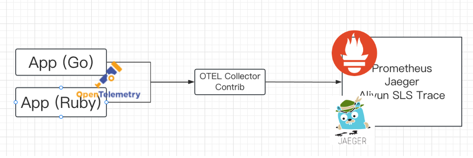
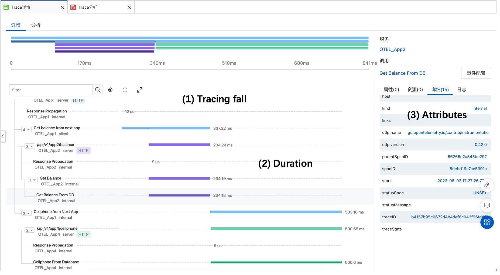
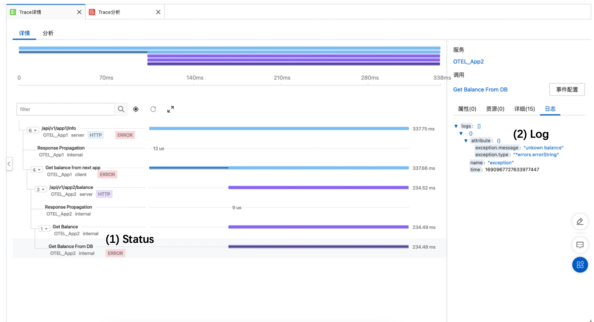

# Srv-webapp-demo: App1 OpenTelemetry Demo


## Tips


### 1. 使用 Otel-Collect-Contrib 初始化 trace.Provider

这里使用 `app -> collector-contrib`  进行转发， 应用不直接对后端的存储。 **适配性** 更高。




`collector-contrib` 最常见的两种协议 `grpc / http(s)`。 传入 endpoint 地址进行初始化 Provider， [代码参考](./pkg/middlewares/otel/provider.go#41)


### 2. 使用 Otelgin 接入 TraceProvider

+ [x] 2. 使用 otelgin 接入 trace.Provider

1. 在 gin 已经实现了一个官方的 Middleware 支持 OpenTelemetry.  参考代码 [gin-gonic/gin/otelgin](https://github.com/open-telemetry/opentelemetry-go-contrib/blob/849072ef827b4abab754253e1e63e7b410a31084/instrumentation/github.com/gin-gonic/gin/otelgin/gintrace.go#L42)

2. 第一步初始化好的 trace.Provider 需要通过 Option 的方式传入, 参考代码 [otel middleware option](./pkg/middlewares/otel/register.go#L8)

3. 


### 3. 完成单服务的 Trace 树状结构

+ [x] 3. 完成单服务的 Trace 树状结构

在使用的时候， 需要使用 Context 在不同的 **函数/方法** 之间传递 Provider。 每个 **函数/方法** 创建自己的 **Span**， 以此实现 **调用的父子关系**。


### [x] 4. 应答客户端时， 在 Header 中默认添加 TraceID
+ [x] 4. 应答客户端时， 在 Header 中默认添加 TraceID


+ [x] 5. 获取前方传递的 traceparent 信息
    1. 使用 `otelgin.WithPropagators(pptc)`
+ [x] 6. 向后传递 Header: traceparent
    1. **这个应该从 context 中获取** 并 **添加到 HTTP Client 请求的 Header** 中。
    2. 而非 **添加到 Response Header** 中。
+ [x] 7. 在 Trace 中添加 Error Log, Status, Attr
    1. `span.RecordError` 提交错误日志
    2. `span.SetStatus` 设置 trace span 状态。 氛围 error 和 ok
    3. `span.SetAttributes` 设置属性，可以通过属性搜索。 (所有属性被 **索引**)。
+ [x] 8. 修改 Trace 中的 Kind 类型。 已知 Otelngin 提供的值为 Sever， 默认的值为 internal
    1. (*) Kind 是标准字段， 是枚举类型。 其中包含 `internal, server, client, producer, consumer` 可以在代码中看到。 
    2. 可以通过 `trace.WithSpanKind`， 在 `trace.Start` 时作为 opt 传入。 之后不能通过 span 设置。
+ [x] 9. 添加自定义属性字段
    1. (*) 自定义字段(Attribute)（类似 host）.
    2. 每个 span 都是独立的。 因此 public attributes 需要在公共函数中注入 [utils/span.go](/pkg/utils/span.go#L27)
    3. 因此使用 Context 进行传递， 在不同的 方法/函数 内进行公共 attr 共享。


## Todo2: Request Tree


```
nginx/web -> app1----> app2(get balance) -----> app3 (check db)
                   \
                    \-> app4(get cellphone) ----> app5 (check redis)
```

**正常图示**




**有 Error 图示**




