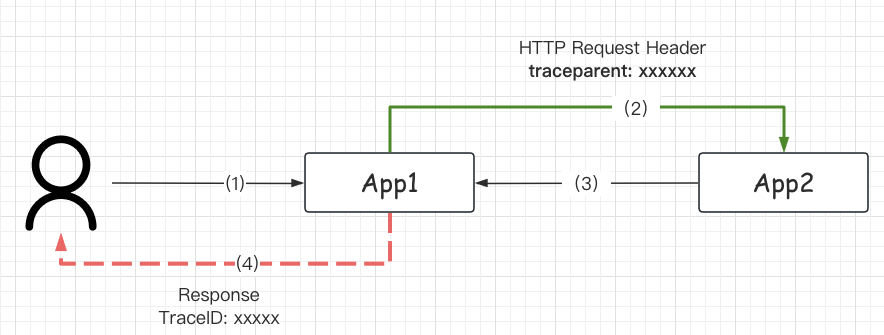

# Go 集成 OpenTelemetry 笔记： （Gin Demo）


## Tips


### 1. 使用 Otel-Collect-Contrib 初始化 trace.Provider

这里使用 `app -> collector-contrib`  进行转发， 应用不直接对后端的存储。 **适配性** 更高。


`collector-contrib` 最常见的两种协议 `grpc / http(s)`。 传入 endpoint 地址进行初始化 Provider， 参考代码 [grpcExporter 和 httpExporter](./pkg/middlewares/otel/provider.go#41)


### 2. 使用 Otelgin 接入 TraceProvider

+ [x] 2. 使用 otelgin 接入 trace.Provider


1. 第一步初始化好的 trace.Provider 需要通过 Option 的方式传入, 参考代码 [otel middleware option](./pkg/middlewares/otel/register.go#L8)

2. 在 gin 已经实现了一个官方的 Middleware 支持 OpenTelemetry.  参考代码 [gin-gonic/gin/otelgin](https://github.com/open-telemetry/opentelemetry-go-contrib/blob/849072ef827b4abab754253e1e63e7b410a31084/instrumentation/github.com/gin-gonic/gin/otelgin/gintrace.go#L42)

3. 在 **#L66** 中， 使用 `c.Set(k,v)` 将 provider 放入了 gin **自己实现的 Context** 中。

4. 在 **#L88-92** 中， `tracer.Start` 启动了第一个 Span， 并将生成的 **ctx** 放入 **Request** 中向下传递。 **之后我们将从 Request 中取 tracer provider**。

5. 在 **#L73,98**, 使用 `httpconv.XXXXX` 方法进行 span 状态设置。 `httpconv` 是一个 OpenTelemetry 实现的 **标准/模版** 方法， 用于处理 http 请求中的各种情况。 可以多跟一下。

6. 在 **#L71-87** 中， 初始化了一些状态。

### 3. 完成单服务的 Trace 树状结构

在使用的时候， 需要使用 Context 在不同的 **函数/方法** 之间传递 Provider。 每个 **函数/方法** 创建自己的 **Span**， 以此实现 **调用的父子关系**。

1. 在 [utils/span.go](./pkg/utils/span.go) 中， 封装了一个函数 `Span(xxxx)` 提出 context 中的 provider 并启动 `tracer.Start(xxx)`。

在 **#L21** 中， 对 `ctx` 进行了判断， 如果 ctx 是 `gin.Context` 的话， 就需要从 Request 中携带的 context， 这一点在上诉的 **2.4.** 中已经说明原因。

额外的进行了一些 **公共属性** 的设置， 例如运行的主机名。


2. 在 [apis/user/info.go](./pkg/apis/user/info.go) 中， 通过 context 在不同 **函数/方法** 之间传递 tracer provider， 每个地方都调用了 `Span(xxx)` 跟踪当前情况。


### 4. 应答客户端时， 在 Header 中默认添加 TraceID

当有需求的时候（例如出现访问错误）， 需要把 TraceID 返回给用户。 这样用户在报错的时候提供 TraceID 可以快速 debug。



在 [otel/response_traceid.go](./pkg/middlewares/otel/response_traceid.go) 创建了一个 Gin Middleware， 将 TraceID 从 Context 中提取出来， 并放到 Response Header 中。

其中用到了 `propagation` 标准库， 简单快捷。


### 5. 获取前方传递的 traceparent 信息

在上图 App2 中， 能够拿到 App 传递的 Traceparent header， 这样就保证了接收侧的 TraceID 连贯性。

1. 在 `otelgin` 中， 提供了一个 Option 注入， [otel/propagation](./pkg/middlewares/otel/propagation.go), 使用 `otelgin.WithPropagators(pptc)`
2. 在 gin 中注册 provider 的时候， 使用 Option 即可, [otel/register.go#L12](./pkg/middlewares/otel/register.go#L12)

### 6. 向后传递 Header: traceparent

为了保证 TraceID 的连贯性， 除了接收侧（App2）。 在 **发送侧 App1** 也需要做对应的操作。

从 Context 中读取 TraceParent 并注入到 HTTP Request Header 中。 

1. 在 [utils/carrier.go#L9](./pkg/utils/carrier.go) 中， 通过 `propagation` 标准库将 Header 字段找出来。
2. 在 [httpclient/client.go#L19](./pkg/httpclient/client.go#L19) 中， 将找到的 Header 字段全部放到新创建的 Request Header 中。

### 7. 在 Trace 中添加 Error Log, Status, Attr

标准 API 用法。 

1. `span.RecordError` 提交错误日志
2. `span.SetStatus` 设置 trace span 状态。 氛围 error 和 ok
3. `span.SetAttributes` 设置属性，可以通过属性搜索。 (所有属性被 **索引**)。


### 8. 修改 Trace 中的 Kind 类型。 已知 Otelngin 提供的值为 Sever， 默认的值为 internal

在 Tracer 启动的时候传入。 启动之后 Span 不能设置。 可以通过 **Kind** 类型， 表明当前步骤类型， 以后在 **检索/查询** 的时候更直观。

1. (*) Kind 是标准字段， 是枚举类型。 其中包含 `internal, server, client, producer, consumer` 可以在代码中看到。 
2. 可以通过 `trace.WithSpanKind`， 在 `trace.Start` 时作为 opt 传入。 之后不能通过 span 设置。

### 9. 添加自定义属性字段

1. (*) 自定义字段(Attribute)（类似 host）.
2. 每个 span 都是独立的。 因此 public attributes 需要在公共函数中注入 [utils/span.go](/pkg/utils/span.go#L27)
3. 因此使用 Context 进行传递， 在不同的 方法/函数 内进行公共 attr 共享。 **（看自己情况实现）**


## Todo2: Request Tree


```
nginx/web -> app1----> app2(get balance) -----> app3 (check db)
                   \
                    \-> app4(get cellphone) ----> app5 (check redis)
```

**正常图示**


**有 Error 图示**


